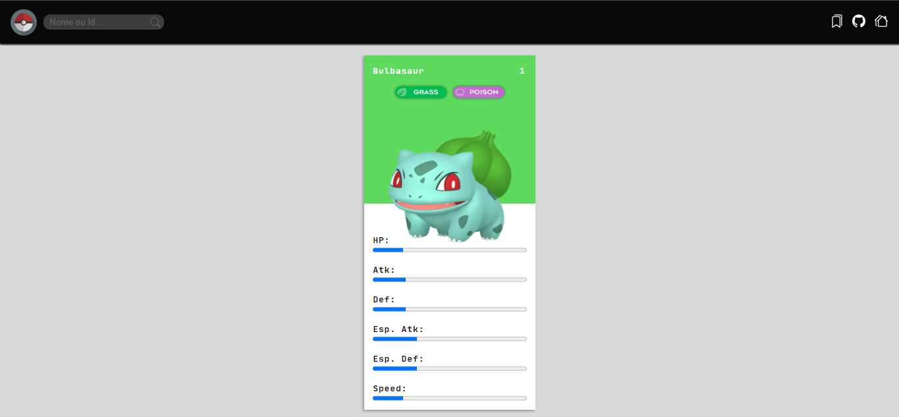

# Projeto Pokedex

## Imagem do projeto:

>Projeto de pokedex desenvolvido com a API pública do pokemon, com o intuito de estudos.

## 🤝 Colaboradores

<table>
  <tr>
    <td align="center">
      <a href="https://github.com/JuanNicolasGS">
         
        
          <b>Juan Nicolas</b>
        
      </a>
    </td>
    <td align="center">
      <a href="https://github.com/Isaac-Yuri">
         
        
          <b>Isaac Yuri</b>
        
      </a>
    </td>
     <td align="center">
      <a href="https://github.com/JonatasNatanOFC">
         
        
          <b>Jonatas Natan</b>
        
      </a>
    </td>
  </tr>
</table>

## 📝 Licença

Esse projeto está sob licença. Veja o arquivo [Licença](LICENSE.md) para mais detalhes.
